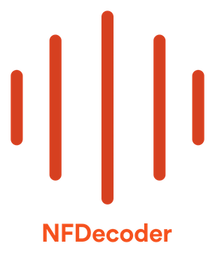

<p align="center">
    
</p>

[](https://circleci.com/gh/spotify/NFDecoder/tree/master)
[](LICENSE)
[](https://slackin.spotify.com)
[](http://clayallsopp.github.io/readme-score?url=https://github.com/spotify/nfdecoder)

A generic cross platform decoder for producing PCM data from encoded audio media formats.

- [x] 📱 [iOS](https://www.apple.com/ios/) 9.0+
- [x] 💻 [OS X](https://www.apple.com/macos/) 10.11+
- [x] 🐧 [Ubuntu](https://www.ubuntu.com/) Bionic 18.04+
- [x] 🤖 [Android](https://developer.android.com/studio/) SDK r24+

Developed at Spotify 2019-2022, Discontinued and handed over to new maintainers January 2023

## Raison D'être :thought_balloon:
At Spotify we have performed studies that show the efficacy of using native backed solutions for interfacing to backends, especially when it came to the battery life of certain devices. In order to carry this forward in the cross-platform C++ world, we created this library that provides a common interface to many audio codecs. 
We found that many of the current solutions that claimed to do this lacked key supports for many kinds of platforms, and ended up being libraries that heavily favoured 1 platform and gave the other platforms a generic implementation. We also wanted something that could extend to new codecs or protocols as they become available.

## Architecture :triangular_ruler:
`NFDecoder` is designed as a common C++ interface to convert audio codecs to PCM! The API allows you to create `decoders` that use a common interface to convert to pcm. There is one main `Factory` that generates a `Decoder`. Both can be platform specific and use native decoders when necessary.

The interfaces are as follows:
- **DataProvider** An interface inspired by C-like file handling APIs that the decoder uses to read data from the audio source.
- **Decrypter** An interface defining how to decrypt frames of data in cause the audio is encrypted.
- **Manifest** An interface describing how to interpret audio retrived from the web and in a  `JSON` format.
- **Factory** An interface to create codec decoders. In order to create the decoder, you pass in a path to the audio source, the mime type and provide instances to the previously described interfaces.

## Supported File Formats
- [x] MPEG2TS
- [x] Ogg Vorbis
- [x] WAV
- [x] MP3
- [x] AAC
- [x] Ogg Opus
- [x] FLAC
- [x] speex

## Dependencies :globe_with_meridians:

- [vorbis](https://xiph.org/vorbis/)
- [ogg](https://www.xiph.org/ogg/)
- [libresample](https://github.com/minorninth/libresample)
- [NFHTTP](https://github.com/spotify/NFHTTP)
- [FFMpeg](https://www.ffmpeg.org/)
- [universal-dash-transmuxer](https://github.com/google/universal-dash-transmuxer)
- [flac](https://github.com/xiph/flac)
- [opus](https://github.com/xiph/opus)
- [opusfile](https://github.com/xiph/opusfile)
- [protobuf](https://developers.google.com/protocol-buffers/)
- [speex](https://github.com/xiph/speex)

## Installation :inbox_tray:

`NFDecoder` is a [Cmake](https://cmake.org/) project, while you are free to download the prebuilt static libraries it is recommended to use Cmake to install this project into your wider project. In order to add this into a wider Cmake project (who needs monorepos anyway?), simply add the following line to your `CMakeLists.txt` file:
```
add_subdirectory(NFDecoder)
```

and, it is required to install `gyp`.

```shell
$ cd tools/gyp/
$ python setup.py install
```

### For iOS/OSX
Generate an [Xcode](https://developer.apple.com/xcode/) project from the Cmake project like so:
```shell
$ git submodule update --init --recursive
$ mkdir build
$ cd build
$ cmake .. -GXcode
```

### For linux
Generate a [Ninja](https://ninja-build.org/) project from the Cmake project like so:
```shell
$ git submodule update --init --recursive
$ mkdir build
$ cd build
$ cmake .. -GNinja
```

### For Android
Use [gradle](https://gradle.org/)
```
android {
    compileSdkVersion 26
    defaultConfig {
        applicationId "com.spotify.nfdecodertest_android"
        minSdkVersion 19
        targetSdkVersion 26
        versionCode 1
        versionName "1.0"
        externalNativeBuild {
            cmake {
                cppFlags ""
                arguments "-DANDROID_APP=1 -DANDROID=1"
            }
        }
    }

    sourceSets {
        main {
            jniLibs.srcDirs = ['src/main/cpp']
        }
    }

    externalNativeBuild {
        cmake {
            path "../CMakeLists.txt"
        }
    }
}
```

## CI
When making changes that will affect audio output, please regenerate and check all inputs. To do this run:
```bash
sh ci/osx.sh build
```
For now one test is provided to the public that tests audio retrieved from the web and ogg playback. We have tested all other formats publicly internally.


## Usage example :eyes:
An example CLI program is in `source/cli/NFDecoderCLI.cpp`.

## Contributing :mailbox_with_mail:
Contributions are welcomed, have a look at the [CONTRIBUTING.md](CONTRIBUTING.md) document for more information.

## License :memo:
The project is available under the [Apache 2.0](http://www.apache.org/licenses/LICENSE-2.0) license.

### Acknowledgements
- Icon in readme banner is "[Audio](https://thenounproject.com/search/?q=audio&i=1382744)" by Royyan Wijaya from the Noun Project.
- Integration test is from [Wikimedia](https://en.wikipedia.org/wiki/File:ACDC_-_Back_In_Black-sample.ogg)

#### Contributors
* [Will Sackfield](https://github.com/8W9aG)
* [Julia Cox](https://github.com/astrocox)
* [David Rubinstein](https://github.com/drubinstein)
* [Justin Sarma](https://github.com/jsarma)
